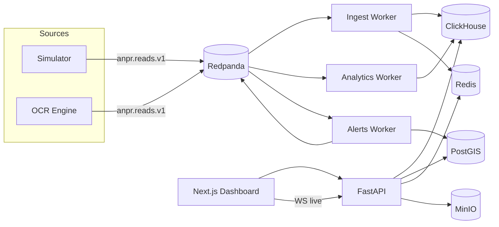

# City-wide ANPR Intelligence Platform

Centralized MVP that ingests license-plate reads from a city-wide camera network (simulated or OCR) and provides trajectory reconstruction, traffic analytics, real-time alerts, and a GIS control-room dashboard.



## Quickstart

```bash
# Prerequisites: Docker/Colima, uv, Node 20+, Python 3.11
cp .env.example .env
make install          # uv sync + pnpm install
make up               # Redpanda, ClickHouse, PostGIS(:5433), Redis, MinIO
make seed             # synthetic graph, cameras, zones, users, watchlist
make backfill         # historical reads (BACKFILL_DAYS=1 for a quick run)

# Terminal A — workers
make workers
# Terminal B — API (use API_PORT=8002 if 8000 is taken)
make api
# Terminal C — live simulation
make simulate
# Terminal D — dashboard
cd apps/dashboard && npx pnpm@9 dev
```

Open http://localhost:3000 — login with:

| Role | User | Password |
|------|------|----------|
| admin | admin | admin123 |
| operator | operator | operator123 |
| analyst | analyst | analyst123 |

If the API is on 8002, set `NEXT_PUBLIC_API_URL=http://localhost:8002` and `NEXT_PUBLIC_WS_URL=ws://localhost:8002/ws/live` before `pnpm dev`.

Demo checklist after `make simulate`:
- `/live` — heatmap, congested segments, alert toasts
- `/track` — search a watchlist plate from `services/simulator/data/scenarios.json` with a case ID
- `/alerts` — watchlist / clone / convoy / loiter / geofence / wrong-way

**Note:** `make seed` / `simulate` / `backfill` use `--synthetic` by default so demos work offline. Drop `--synthetic` in the Makefile to prefer live OSM when network is available.

## Makefile targets

| Target | Purpose |
|--------|---------|
| `make up` / `make down` | Start/stop infra |
| `make seed` | Seed PostGIS + Redis + scenarios |
| `make backfill` | Historical reads |
| `make simulate` | Live simulation at `SIM_SPEED` |
| `make test` | Unit tests (`RUN_INTEGRATION=1` for e2e) |
| `make types` | JSON Schema → TypeScript types |
| `make eval` | OCR eval on bundled synthetic set |

Use `UV_PROJECT_ENVIRONMENT=.venv311` if the default `.venv` is locked on your machine.

## Supplying model weights

Weights are **never committed**. Place files under `models/` (gitignored):

```bash
export PLATE_DET_WEIGHTS=/absolute/path/to/plate_det.pt
# optional custom PARSeq checkpoint
export PARSEEQ_WEIGHTS=/absolute/path/to/parseq.pt
```

Train a plate detector:

```bash
uv run python -m ocr_engine.train.train_plate_detector --data path/to/data.yaml
```

Fine-tune PARSeq (template):

```bash
uv run python -m ocr_engine.train.finetune_parseq --data-dir data/synth
```

Generate synthetic plates:

```bash
uv run python -m ocr_engine.train.synth_plates --out data/synth --count 5000
```

### Running OCR on your own clips

```bash
ocr-engine run --source /path/to/clip.mp4 --camera-id cam-001 --dry-run
# without --dry-run: publishes to Kafka + MinIO
```

If `PLATE_DET_WEIGHTS` is missing, the OCR process exits non-zero with setup instructions. The rest of the platform (simulator path) is unaffected.

GPU profile: `docker compose --profile gpu up ocr-engine-gpu` (NVIDIA runtime). Jetson (TensorRT via ultralytics export) and Hailo are deployment notes only — not bundled.

## Evaluation methodology

```bash
make eval
# → reports/ocr_eval.md
```

- Input CSV: `image_path, gt_plate, tags` (day, night, rain, fog, angle_gt30, blur, dirty, damaged, two_row)
- Primary metric: plate-level exact-match accuracy (overall and per tag)
- Secondary: character accuracy
- Report includes confusion pairs and worst failures with timestamp and model identifiers
- **No fabricated metrics** anywhere — numbers only come from `make eval`

Default harness uses `MockRecognizer` on the bundled synthetic fixture so CI does not need PARSeq weights. For real measurement: `uv run python -m ocr_engine.eval --recognizer parseq`.

## Privacy controls

- **RBAC** — analysts cannot call plate-level `/trajectory` (enforced + tested)
- **Case IDs** — required on every trajectory query
- **Audit log** — every trajectory access recorded
- **Retention TTL** — ClickHouse `anpr_reads` TTL = `RAW_RETENTION_DAYS` (default 30)
- **k-anonymity** — OD API suppresses cells with fewer than `OD_K_ANON` trips

## What is stubbed

| Component | Interface | No-op | How to replace |
|-----------|-----------|-------|----------------|
| Heavy plate restoration (deblur/SR) | `Enhancer` | `NoopEnhancer` — CLAHE + gating are real | Plug a restoration model into `Enhancer.enhance()` |
| Vahan plate↔vehicle registry | `RegistryClient` | `NoopRegistryClient` returns unknown | Implement `lookup(plate)` against Vahan; wire into `PlateVehicleMismatchRule` |

## Scaling notes

- Replace Python consumers with **Flink** or **Rust** for higher ingest rates; keep the same Kafka schemas
- Shard **ClickHouse** (`anpr_reads` already partitioned by day) for multi-city retention
- Edge: run `ocr-engine` on Jetson/Hailo cameras, publish only `PlateRead` events upstream

## Repository layout

See `PLAN.md` for phase checklist. Packages: `anpr_common`, `simulator`, `workers`, `api`, `ocr_engine`, `apps/dashboard`.
