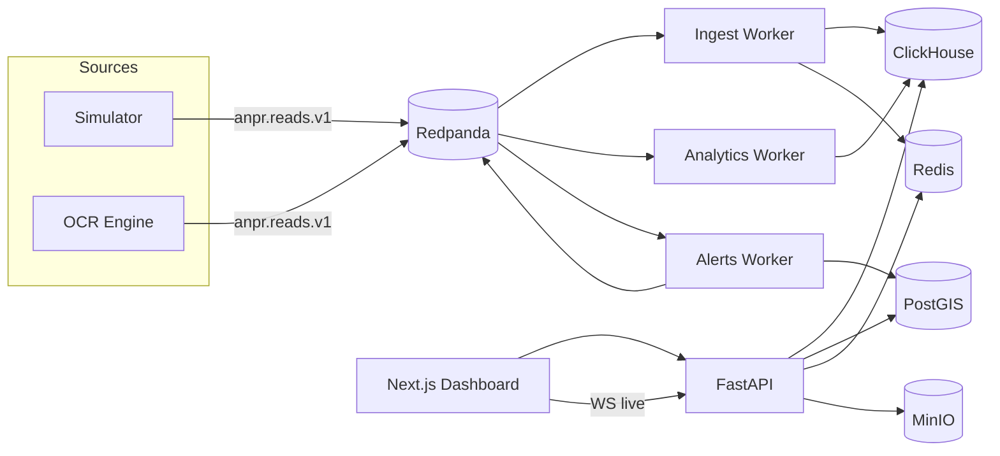
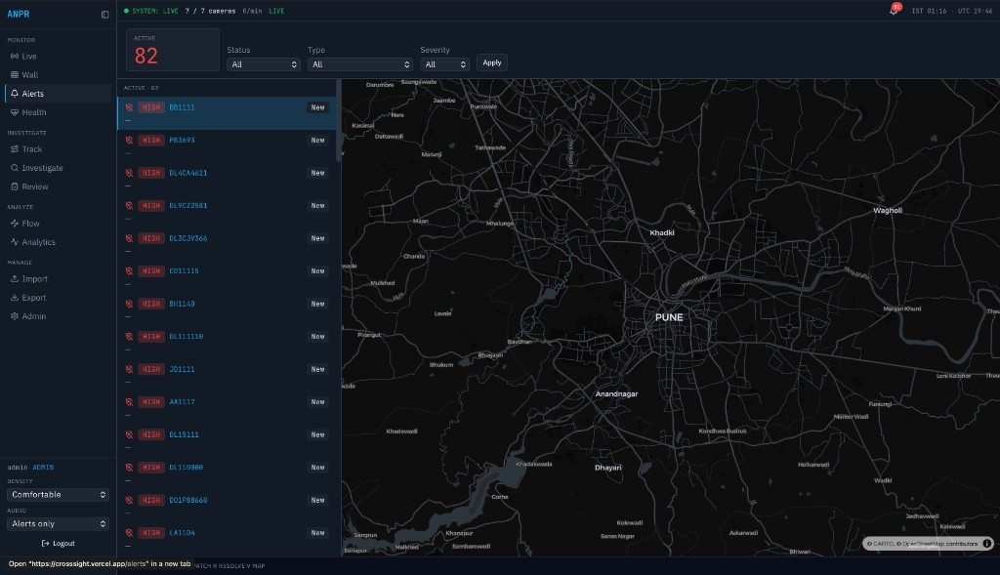
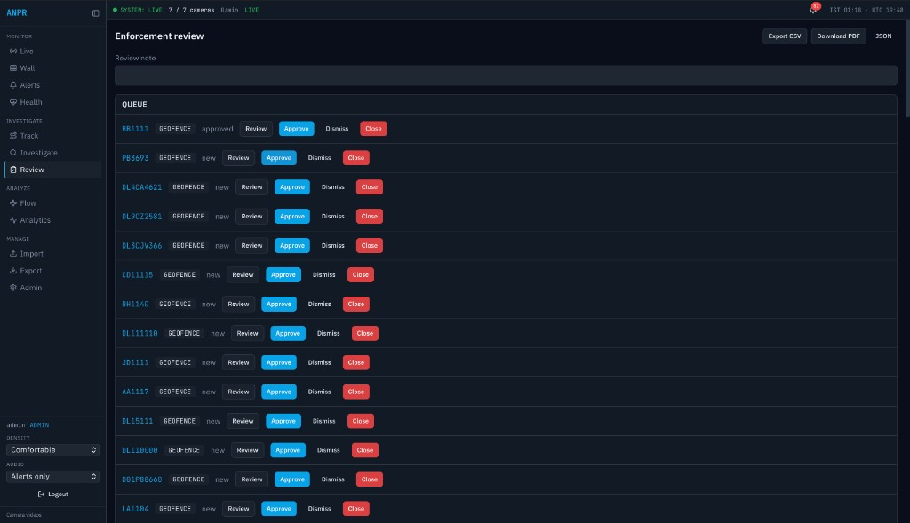
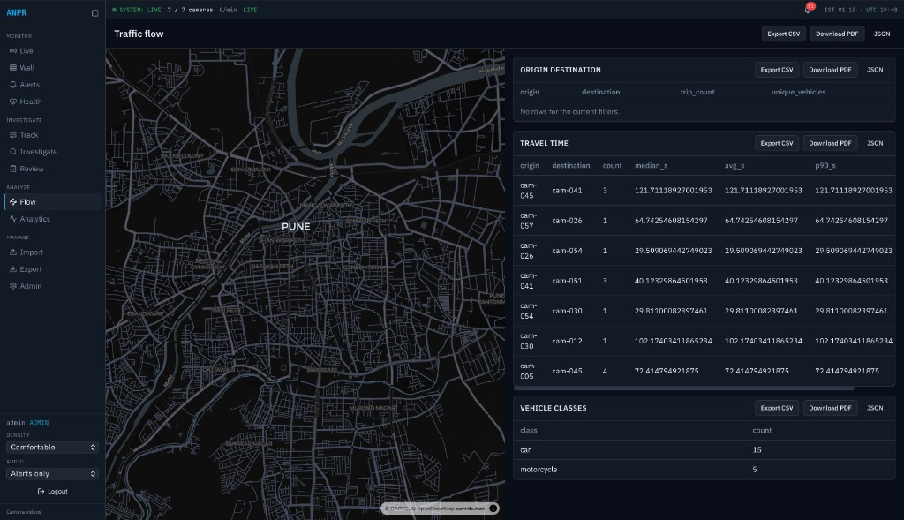
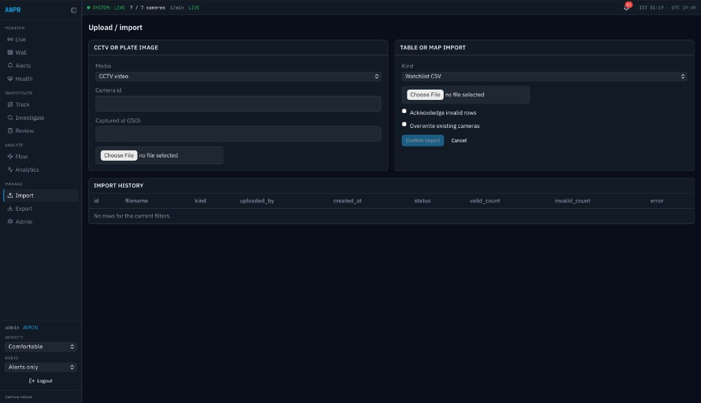

# City-wide ANPR Intelligence Platform

Centralized MVP that ingests license-plate reads from a city-wide camera network (simulated or OCR) and provides trajectory reconstruction, traffic analytics, real-time alerts, and a GIS control-room dashboard.


```mermaid
flowchart LR
  subgraph sources [Sources]
    SIM[Simulator]
    OCR[OCR Engine]
  end
  RP[(Redpanda)]
  SIM -->|anpr.reads.v1| RP
  OCR -->|anpr.reads.v1| RP
  RP --> ING[Ingest Worker]
  RP --> AN[Analytics Worker]
  RP --> AL[Alerts Worker]
  ING --> CH[(ClickHouse)]
  ING --> RD[(Redis)]
  AN --> CH
  AL --> PG[(PostGIS)]
  AL --> RP
  API[FastAPI] --> CH
  API --> PG
  API --> RD
  API --> MINIO[(MinIO)]
  DASH[Next.js Dashboard] --> API
  DASH -->|WS live| API
```

## Dashboard

Control-room UI (Pune demo). Open [https://crosssight.vercel.app/](https://crosssight.vercel.app/).

**Live** (`/live`) — city map, live plate reads, critical alerts, speed, and congested segments.


**Wall** (`/wall`) — live camera grid with plate overlays.


**Alerts** (`/alerts`) — active queue with severity, type, and status filters, plotted on the map.



**Track** (`/track`) — plate search, read timeline, and playback of the reconstructed path.


**Review** (`/review`) — enforcement queue: approve, dismiss, or close a case, then export.



**Flow** (`/flow`) — origin–destination, travel time, and vehicle class tables on the city map.



**Analytics** (`/analytics`) — corridor density, camera flow, bottlenecks, and volume anomalies.


**Import** (`/imports`) — CCTV or plate stills, plus watchlist and camera-table ingest.



## Implementation status

The spec MVP runs end to end on simulated reads. Real-world OCR measurement and production deployment are still open; the modules below cover the product pillars.

### Implemented

| Area | What is in place |
| --- | --- |
| Shared platform | Indian plate grammar, fuzzy matching, schemas for reads / alerts (incl. `route_anomaly`) / flow (lane + congestion_index) |
| Infrastructure | Docker: Redpanda, ClickHouse, PostGIS, Redis, MinIO. Makefile: seed, simulate, tests, eval, fleet OCR |
| Simulator | Synthetic city, ~60 cameras, scripted watchlist / clone / convoy / loiter / wrong-way / geofence cases |
| Workers | Ingest, analytics (per-lane flow, congestion, OD, route-density, bottlenecks), alerts (watchlist, clone, convoy, loiter, geofence, wrong-way, **route anomaly**, FileRegistry mismatch (when `REGISTRY_PATH` set; noop otherwise)) |
| API | Trajectory + audit/RBAC, heatmap/flow/segments/OD/bottlenecks/anomalies/**route-density**, alerts workflow, **`GET /crops`** |
| Dashboard | `/live` map, reads, alerts, congestion; `/wall` camera grid; `/alerts`; `/track` path + **crop thumbs**; `/review` enforcement queue; `/flow` OD and travel time; `/analytics` corridors; `/imports`; `/admin` |
| OCR engine | PlateOCR **`india-v1`** (default) + Indian format decode, CLAHE/classical deblur, lane attribution, multi-frame fusion, fleet CLI + RTSP reconnect; legacy YOLO+PARSeq |

### Left

| Area | What is still open |
| --- | --- |
| Learned SR / deblur | Classical deblur is live; swap in a trained model via `Enhancer` |
| Vahan registry | Set `REGISTRY_PATH` for local JSON demos; live Vahan client still needed for production |
| PARSeq fine-tune | Legacy template only — prefer CCT fine-tune for Indian plates |
| Hard-condition India GT | India crops **74.0%** (+TTA) / scenes **60%** exact (**96%** found) — still short of >90%; labelled multi-lane night/rain India still needed |
| Real cameras | Fleet config is ready — point it at your RTSP/files |
| Global multi-region OCR | Default is india-v1; switch to `cct-s-v2-global-model` when needed |
| Edge and scale | Jetson/Hailo/TensorRT/Flink/CH cluster are notes only |
| Production auth | Demo users in `.env.example` |


## Measured OCR claims (2026-09-30)

Full tables: [`reports/ocr_benchmark.md`](reports/ocr_benchmark.md) · reproduce: `uv run python scripts/run_ocr_benchmarks.py`

| Claim | Model | Dataset | Exact | Found | Char | n |
| --- | --- | --- | ---: | ---: | ---: | ---: |
| **>90% multi-region OCR** | `cct-s-v2-global-model` | OpenALPR EU+BR+US | **91.7%** | **100%** | **98.1%** | 444 |
| India OCR (default + TTA) | `india-v1` + format + TTA | Zenitsu crops ~30 states | **74.0%** | **100%** | **93.3%** | 1,684 |
| India OCR (no TTA) | `india-v1` + format | Zenitsu crops | 73.0% | 100% | 92.9% | 1,684 |
| India OCR (synthetic) | `india-v1` + format + TTA | Kaggle synth private MH/KA/DL/GJ | **67.8%** | **100%*** | **96.2%** | 400 |
| India detect+OCR (+ pad/TTA) | `india-v1` + format | Datacluster full scenes | **60.0%** | **96%** | 77.1% | 25 |
| India without fine-tune | global CCT | Zenitsu crops | 31.1% | 100% | 77.3% | 1,684 |

\*crop-only (no detector). Full tables: [`reports/FINAL_RESULTS.md`](reports/FINAL_RESULTS.md).

**Notes (measured, not marketing):**

- The **>90%** claim is validated on OpenALPR (real cars, EU/Brazil/US). EU **92.6%**, Brazil **98.2%**, US **87.8%**.
- For **Indian** plates, default is `india-v1.1` + Indian format decoding, TTA off (**73.0%** exact on 1,684 crops). TTA adds +1.0 pt (within the ±2.2 pt margin) for ~7x OCR latency, so it is off by default (`PLATEOCR_TTA=1` to enable). Still **not** a >90% India claim.
- Multi-lane / night / rain **Indian gantry** >90% is **not** claimed (no labelled set).

## Quickstart

```bash
# Prerequisites: Docker/Colima, uv, Node 20+, Python 3.11
cp .env.example .env
make install          # uv sync + pnpm install
make up               # Redpanda, ClickHouse, PostGIS(:5433), Redis, MinIO
make seed             # synthetic graph, cameras, zones, users, watchlist
make backfill         # historical reads (BACKFILL_DAYS=1 for a quick run)

# Terminal A — workers
make workers
# Terminal B — API (use API_PORT=8002 if 8000 is taken)
make api
# Terminal C — live simulation
make simulate
# Terminal D — dashboard
cd apps/dashboard && npx pnpm@9 dev
```

Open [https://crosssight.vercel.app/](https://crosssight.vercel.app/) — login with:


| Role     | User     | Password    |
| -------- | -------- | ----------- |
| admin    | admin    | admin123    |
| operator | operator | operator123 |
| analyst  | analyst  | analyst123  |


If the API is on 8002, set `NEXT_PUBLIC_API_URL=http://localhost:8002` and `NEXT_PUBLIC_WS_URL=ws://localhost:8002/ws/live` before `pnpm dev`.

Demo checklist after `make simulate`:

- `/live` — heatmap, congested segments, route-density corridors, alert toasts
- `/wall` — live camera grid
- `/alerts` — watchlist / clone / convoy / loiter / geofence / wrong-way / route anomaly
- `/track` — search a watchlist plate from `services/simulator/data/scenarios.json` with a case ID
- `/review` — approve, dismiss, or close queued cases
- `/flow` — origin–destination, travel time, vehicle classes
- `/analytics` — corridors, bottlenecks, volume anomalies
- `/imports` — CCTV, plate stills, watchlist CSV

**Note:** `make seed` / `simulate` / `backfill` use `--synthetic` by default so demos work offline. Drop `--synthetic` in the Makefile to prefer live OSM when network is available.

## Makefile targets


| Target                  | Purpose                                  |
| ----------------------- | ---------------------------------------- |
| `make up` / `make down` | Start/stop infra                         |
| `make seed`             | Seed PostGIS + Redis + scenarios         |
| `make backfill`         | Historical reads                         |
| `make simulate`         | Live simulation at `SIM_SPEED`           |
| `make test`             | Unit tests (`RUN_INTEGRATION=1` for e2e) |
| `make types`            | JSON Schema → TypeScript types           |
| `make eval`             | OCR eval on bundled synthetic set (mock recognizer) |
| `make eval-plateocr`    | OCR eval with real PlateOCR weights                 |
| `make fleet-ocr`        | Multi-camera OCR dry-run from example fleet config  |
| `make benchmark-ocr`    | Full OpenALPR + India dataset OCR benchmark → `reports/` |
| `make prove-scenarios`  | Offline alert-rules proof vs scenarios.json         |
| `make city-load`        | Multi-cam load + latency → `reports/city_load.*`    |
| `make ops-check`        | Worker health + Kafka consumer lag                  |
| `make prod-up`          | Split workers + scaled alerts (`ALERTS_REPLICAS`)   |


Use `UV_PROJECT_ENVIRONMENT=.venv311` if the default `.venv` is locked on your machine.

## Supplying model weights

**Default (`OCR_BACKEND=plateocr`):** uses PlateOCR's **`india-v1.1`** fine-tune + Indian format decoding. `india-v1.1` is `india-v1` with its ONNX `Einsum` ops rewritten as `MatMul`: identical predictions, ~2x faster on CPU. On first run weights download to:

- `~/.cache/open-image-models/yolo-v9-s-608-license-plate-end2end/` (detector, ~28 MB)
- `~/.cache/plate-ocr/india-v1.1/` (India OCR ONNX + config, ~5 MB, SHA-256 verified)
- In Docker these live in the `ocr_model_cache` volume (`/root/.cache`), so they download once.
- Optional global OCR: set `PLATEOCR_OCR_MODEL=cct-s-v2-global-model` → `~/.cache/fast-plate-ocr/`

Upstream reference vendored under `vendor/PlateOCR` from [Ajitesh-07/PlateOCR](https://github.com/Ajitesh-07/PlateOCR) (india-v1, `plate_format.py`, finetune/). See `vendor/PlateOCR/MODEL_CARD.md`.

**Legacy (`OCR_BACKEND=legacy`):** place YOLO plate detector under `models/` (gitignored):

```bash
export OCR_BACKEND=legacy
export PLATE_DET_WEIGHTS=/absolute/path/to/plate_det.pt
# optional custom PARSeq checkpoint
export PARSEEQ_WEIGHTS=/absolute/path/to/parseq.pt
```

Train a plate detector (legacy):

```bash
uv run python -m ocr_engine.train.train_plate_detector --data path/to/data.yaml
```

Fine-tune PARSeq (legacy template):

```bash
uv run python -m ocr_engine.train.finetune_parseq --data-dir data/synth
```

Generate synthetic plates:

```bash
uv run python -m ocr_engine.train.synth_plates --out data/synth --count 5000
```


### Running OCR on your own clips

```bash
# PlateOCR (default = india-v1.1 + Indian format decode)
uv run python -m ocr_engine.cli image --source vendor/PlateOCR/samples/test_image.png --dry-run
uv run python -m ocr_engine.cli run --source /path/to/clip.mp4 --camera-id cam-001 --dry-run
uv run python -m ocr_engine.cli run --source clip.mp4 --camera-id cam-001 --ocr-model india-v1.1 --plate-format india

# Annotated output video + real capture timestamps (file recorded at 09:00 UTC)
uv run python -m ocr_engine.cli run --source clip.mp4 --camera-id cam-001 --dry-run \n  --annotate-out out.mp4 --start-time 2026-09-30T09:00:00

# CPU-only host: process every 3rd frame
uv run python -m ocr_engine.cli run --source rtsp://cam/stream --camera-id cam-001 --stride 3

# Global multi-region OCR (non-Indian)
uv run python -m ocr_engine.cli run --source clip.mp4 --camera-id cam-001 --ocr-model cct-s-v2-global-model --plate-format none

# Multi-camera fleet (files and/or RTSP, with reconnect)
uv run python -m ocr_engine.cli fleet --config services/ocr_engine/config/cameras.example.json --dry-run

# Legacy YOLO+PARSeq
uv run python -m ocr_engine.cli run --source /path/to/clip.mp4 --camera-id cam-001 --backend legacy --dry-run
```

Without `--dry-run`, events publish to Kafka + MinIO. The rest of the platform (simulator path) is unaffected.

What the video pipeline emits:

- **One `PlateRead` per vehicle.** A track ends only when ByteTrack drops it (plate unseen for 45 processed frames), so a vehicle's event appears ~1.5 s after it leaves the frame at 30 fps. The live preview (`frames` channel) is real time.
- **`ts` is the capture time** of the last frame the plate was seen in: wall clock for RTSP, `--start-time` (default: now) + frame offset for files.
- **The evidence crop** (`crop_key`) is the unmodified camera crop.

OCR tuning (env / `.env`):

| Variable | Default | Effect |
|---|---|---|
| `PLATEOCR_OCR_MODEL` | `india-v1.1` | `india-v1.1`, `india-v1`, `cct-s-v2-global-model` (non-Indian), or a `.onnx` path |
| `PLATEOCR_MIN_OCR_CONF` | `0.5` | Drop per-frame reads below this confidence (garbage scores ~0.05-0.2) |
| `PLATEOCR_TTA` / `PLATEOCR_BBOX_PAD` | `0` / `0` | Accuracy extras; ~7x / ~4x OCR cost. Leave off for live video |
| `OCR_FRAME_STRIDE` | `1` | Process every Nth frame (2-3 on CPU-only hosts) |
| `WATCHLIST_MIN_CONF` | `0.5` | Reads below this never raise watchlist alerts |

Speed (RTX 4060 laptop, full pipeline, 720p-1080p): ~29-35 ms/frame, faster than real time. CPU is ~1 s/frame (dominated by the YOLOv9 detector): use a GPU for live cameras.

GPU profile: `docker compose --profile gpu up ocr-engine-gpu` (NVIDIA runtime; the image ships CUDA 13 + cuDNN 9 via pip, so the host driver must support CUDA 13). Set `OCR_SOURCE` (file path or RTSP URL) and `OCR_CAMERA_ID`. Jetson (TensorRT via ultralytics export) and Hailo are deployment notes only — not bundled.

## Evaluation methodology

```bash
make eval
```

- Input CSV: `image_path, gt_plate, tags` (day, night, rain, fog, angle_gt30, blur, dirty, damaged, two_row)
- Primary metric: plate-level exact-match accuracy (overall and per tag)
- Secondary: character accuracy
- Report includes confusion pairs and worst failures with timestamp and model identifiers
- **No fabricated metrics** anywhere — numbers only come from `make eval`

Default harness uses `MockRecognizer` on the bundled synthetic fixture so CI does not need weights. For PlateOCR measurement: `uv run python -m ocr_engine.eval --recognizer plateocr`. Legacy: `--recognizer parseq`.

## Privacy controls

- **RBAC** — analysts cannot call plate-level `/trajectory` (enforced + tested)
- **Case IDs** — required on every trajectory query
- **Audit log** — every trajectory access recorded
- **Retention TTL** — ClickHouse `anpr_reads` TTL = `RAW_RETENTION_DAYS` (default 30)
- **k-anonymity** — OD API suppresses cells with fewer than `OD_K_ANON` trips


## What is stubbed


| Component                           | Interface        | No-op / demo path                            | How to replace                                                                |
| ----------------------------------- | ---------------- | -------------------------------------------- | ----------------------------------------------------------------------------- |
| Learned plate restoration (SR)      | `Enhancer`       | `ClassicalDeblurEnhancer` is the default classical path; `NoopEnhancer` still available | Plug a trained deblur/SR model into `Enhancer.enhance()`                      |
| Vahan plate↔vehicle registry        | `RegistryClient` | `NoopRegistryClient` by default; set `REGISTRY_PATH` for `FileRegistryClient` | Implement `lookup(plate)` against Vahan; wire into `PlateVehicleMismatchRule` |


## Future scope

Roadmap after the running MVP (simulated city, measured OCR, control-room dashboard).

1. **City-scale real-time CCTV integration.** Extend CrossSight from simulated and uploaded feeds to continuous RTSP/IP camera streams, so real-time ANPR, vehicle tracking, and cross-camera intelligence cover an entire city.
2. **Advanced Indian ANPR optimization.** Build and curate a diverse Indian license-plate dataset covering night, rain, highways, gantries, and hard urban conditions, then fine-tune the model for real-world accuracy.
3. **Durable and scalable job processing.** Add a dedicated Kafka-based job layer for reliable background processing, automatic retries, failure recovery, and large asynchronous workloads.
4. **Horizontal city-scale architecture.** Move the processing layer to distributed Rust/Flink stream processing so CrossSight can grow from hundreds to thousands of cameras and support multi-city deployments.
5. **Privacy and regulatory compliance.** Add a privacy-by-design layer aligned with India’s DPDP Act: data retention policies, purpose-based access, privacy-preserving storage, and data-subject workflows.
6. **Evidence-grade investigation and auditability.** Strengthen the evidence pipeline with cryptographic hashing, tamper-evident audit logs, immutable evidence records, and standardized exports for formal investigations.
7. **Multi-tenant and government deployment.** Support multi-city, multi-agency, and multi-tenant operation so separate police departments, municipal bodies, and control rooms can deploy on one platform.

## Scaling notes

- Replace Python consumers with **Flink** or **Rust** for higher ingest rates; keep the same Kafka schemas
- Shard **ClickHouse** (`anpr_reads` already partitioned by day) for multi-city retention
- Edge: run `ocr-engine` on Jetson/Hailo cameras, publish only `PlateRead` events upstream
- **Alerts (city-scale):** zone membership is cached in-process (refreshed ~60s); convoy uses plate→camera Redis indexes; alert dedupe + loiter counts are Redis-backed so you can run multiple alert workers in one Kafka group. Scale with `ALERTS_REPLICAS=3 make prod-up` (or `docker compose --profile prod up --scale workers-alerts=3`). Check lag with `make ops-check`; if alerts fall behind, seek to tip only after accepting lost catch-up: `rpk group seek anpr-alerts --to end --topics anpr.reads.v1`


## Repository layout

See `PLAN.md` for phase checklist. Packages: `anpr_common`, `simulator`, `workers`, `api`, `ocr_engine`, `apps/dashboard`.