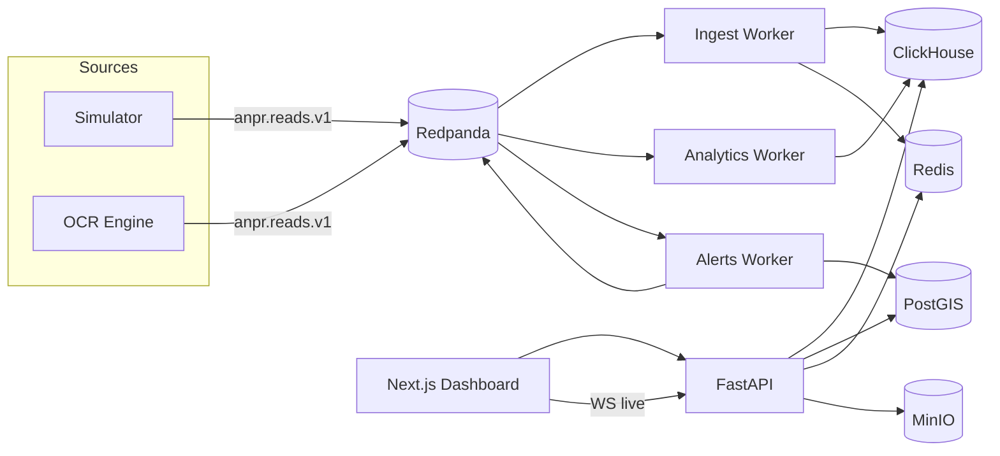

# City-wide ANPR Intelligence Platform

Centralized MVP that ingests license-plate reads from a city-wide camera network (simulated or OCR) and provides trajectory reconstruction, traffic analytics, real-time alerts, and a GIS control-room dashboard.


```mermaid
flowchart LR
  subgraph sources [Sources]
    SIM[Simulator]
    OCR[OCR Engine]
  end
  RP[(Redpanda)]
  SIM -->|anpr.reads.v1| RP
  OCR -->|anpr.reads.v1| RP
  RP --> ING[Ingest Worker]
  RP --> AN[Analytics Worker]
  RP --> AL[Alerts Worker]
  ING --> CH[(ClickHouse)]
  ING --> RD[(Redis)]
  AN --> CH
  AL --> PG[(PostGIS)]
  AL --> RP
  API[FastAPI] --> CH
  API --> PG
  API --> RD
  API --> MINIO[(MinIO)]
  DASH[Next.js Dashboard] --> API
  DASH -->|WS live| API
```


## Implementation status

The spec MVP runs end to end on simulated reads. Real-world OCR measurement and production deployment are still open; the modules below cover the product pillars.

### Implemented

| Area | What is in place |
| --- | --- |
| Shared platform | Indian plate grammar, fuzzy matching, schemas for reads / alerts (incl. `route_anomaly`) / flow (lane + congestion_index) |
| Infrastructure | Docker: Redpanda, ClickHouse, PostGIS, Redis, MinIO. Makefile: seed, simulate, tests, eval, fleet OCR |
| Simulator | Synthetic city, ~60 cameras, scripted watchlist / clone / convoy / loiter / wrong-way / geofence cases |
| Workers | Ingest, analytics (per-lane flow, congestion, OD, route-density, bottlenecks), alerts (watchlist, clone, convoy, loiter, geofence, wrong-way, **route anomaly**, FileRegistry mismatch) |
| API | Trajectory + audit/RBAC, heatmap/flow/segments/OD/bottlenecks/anomalies/**route-density**, alerts workflow, **`GET /crops`** |
| Dashboard | `/live` heatmap + route-density + speed KPI; `/track` path + **crop thumbs**; `/analytics`; `/alerts` incl. route anomaly; `/admin` |
| OCR engine | PlateOCR (default) + CLAHE/classical deblur, lane attribution, multi-frame fusion, **fleet CLI with RTSP reconnect**, legacy YOLO+PARSeq |

### Left

| Area | What is still open |
| --- | --- |
| Learned SR / deblur | Classical deblur is live; swap in a trained model via `Enhancer` |
| Vahan registry | Set `REGISTRY_PATH` for local JSON demos; live Vahan client still needed for production |
| PARSeq fine-tune | Legacy template only — prefer CCT fine-tune for Indian plates |
| Measured OCR accuracy | CI uses mock recognizer; run `make eval-plateocr` on real crops (never fabricate >90%) |
| Real cameras | Fleet config is ready — point it at your RTSP/files |
| Indian plate fine-tune | Global CCT + grammar until local fine-tune |
| Edge and scale | Jetson/Hailo/TensorRT/Flink/CH cluster are notes only |
| Production auth | Demo users in `.env.example` |


## Quickstart

```bash
# Prerequisites: Docker/Colima, uv, Node 20+, Python 3.11
cp .env.example .env
make install          # uv sync + pnpm install
make up               # Redpanda, ClickHouse, PostGIS(:5433), Redis, MinIO
make seed             # synthetic graph, cameras, zones, users, watchlist
make backfill         # historical reads (BACKFILL_DAYS=1 for a quick run)

# Terminal A — workers
make workers
# Terminal B — API (use API_PORT=8002 if 8000 is taken)
make api
# Terminal C — live simulation
make simulate
# Terminal D — dashboard
cd apps/dashboard && npx pnpm@9 dev
```

Open [http://localhost:3000](http://localhost:3000) — login with:


| Role     | User     | Password    |
| -------- | -------- | ----------- |
| admin    | admin    | admin123    |
| operator | operator | operator123 |
| analyst  | analyst  | analyst123  |


If the API is on 8002, set `NEXT_PUBLIC_API_URL=http://localhost:8002` and `NEXT_PUBLIC_WS_URL=ws://localhost:8002/ws/live` before `pnpm dev`.

Demo checklist after `make simulate`:

- `/live` — heatmap, congested segments, route-density corridors, alert toasts
- `/track` — search a watchlist plate from `services/simulator/data/scenarios.json` with a case ID
- `/alerts` — watchlist / clone / convoy / loiter / geofence / wrong-way / route anomaly

**Note:** `make seed` / `simulate` / `backfill` use `--synthetic` by default so demos work offline. Drop `--synthetic` in the Makefile to prefer live OSM when network is available.

## Makefile targets


| Target                  | Purpose                                  |
| ----------------------- | ---------------------------------------- |
| `make up` / `make down` | Start/stop infra                         |
| `make seed`             | Seed PostGIS + Redis + scenarios         |
| `make backfill`         | Historical reads                         |
| `make simulate`         | Live simulation at `SIM_SPEED`           |
| `make test`             | Unit tests (`RUN_INTEGRATION=1` for e2e) |
| `make types`            | JSON Schema → TypeScript types           |
| `make eval`             | OCR eval on bundled synthetic set (mock recognizer) |
| `make eval-plateocr`    | OCR eval with real PlateOCR weights                 |
| `make fleet-ocr`        | Multi-camera OCR dry-run from example fleet config  |


Use `UV_PROJECT_ENVIRONMENT=.venv311` if the default `.venv` is locked on your machine.

## Supplying model weights

**Default (`OCR_BACKEND=plateocr`):** no local weight files required. On first run FastALPR downloads ONNX models (~33 MB) to:

- `~/.cache/open-image-models/yolo-v9-s-608-license-plate-end2end/`
- `~/.cache/fast-plate-ocr/cct-s-v2-global-model/`

Reference implementation vendored under `vendor/PlateOCR` from [Ajitesh-07/PlateOCR](https://github.com/Ajitesh-07/PlateOCR).

**Legacy (`OCR_BACKEND=legacy`):** place YOLO plate detector under `models/` (gitignored):

```bash
export OCR_BACKEND=legacy
export PLATE_DET_WEIGHTS=/absolute/path/to/plate_det.pt
# optional custom PARSeq checkpoint
export PARSEEQ_WEIGHTS=/absolute/path/to/parseq.pt
```

Train a plate detector (legacy):

```bash
uv run python -m ocr_engine.train.train_plate_detector --data path/to/data.yaml
```

Fine-tune PARSeq (legacy template):

```bash
uv run python -m ocr_engine.train.finetune_parseq --data-dir data/synth
```

Generate synthetic plates:

```bash
uv run python -m ocr_engine.train.synth_plates --out data/synth --count 5000
```


### Running OCR on your own clips

```bash
# PlateOCR (default) — auto weights, detect+read+grammar
uv run python -m ocr_engine.cli image --source vendor/PlateOCR/samples/test_image.png --dry-run
uv run python -m ocr_engine.cli run --source /path/to/clip.mp4 --camera-id cam-001 --dry-run

# Multi-camera fleet (files and/or RTSP, with reconnect)
uv run python -m ocr_engine.cli fleet --config services/ocr_engine/config/cameras.example.json --dry-run

# Legacy YOLO+PARSeq
uv run python -m ocr_engine.cli run --source /path/to/clip.mp4 --camera-id cam-001 --backend legacy --dry-run
```

Without `--dry-run`, events publish to Kafka + MinIO. The rest of the platform (simulator path) is unaffected.

GPU profile: `docker compose --profile gpu up ocr-engine-gpu` (NVIDIA runtime). Jetson (TensorRT via ultralytics export) and Hailo are deployment notes only — not bundled.

## Evaluation methodology

```bash
make eval
# → reports/ocr_eval.md
```

- Input CSV: `image_path, gt_plate, tags` (day, night, rain, fog, angle_gt30, blur, dirty, damaged, two_row)
- Primary metric: plate-level exact-match accuracy (overall and per tag)
- Secondary: character accuracy
- Report includes confusion pairs and worst failures with timestamp and model identifiers
- **No fabricated metrics** anywhere — numbers only come from `make eval`

Default harness uses `MockRecognizer` on the bundled synthetic fixture so CI does not need weights. For PlateOCR measurement: `uv run python -m ocr_engine.eval --recognizer plateocr`. Legacy: `--recognizer parseq`.

## Privacy controls

- **RBAC** — analysts cannot call plate-level `/trajectory` (enforced + tested)
- **Case IDs** — required on every trajectory query
- **Audit log** — every trajectory access recorded
- **Retention TTL** — ClickHouse `anpr_reads` TTL = `RAW_RETENTION_DAYS` (default 30)
- **k-anonymity** — OD API suppresses cells with fewer than `OD_K_ANON` trips


## What is stubbed


| Component                           | Interface        | No-op / demo path                            | How to replace                                                                |
| ----------------------------------- | ---------------- | -------------------------------------------- | ----------------------------------------------------------------------------- |
| Learned plate restoration (SR)      | `Enhancer`       | `ClassicalDeblurEnhancer` is the default classical path; `NoopEnhancer` still available | Plug a trained deblur/SR model into `Enhancer.enhance()`                      |
| Vahan plate↔vehicle registry        | `RegistryClient` | `NoopRegistryClient` by default; set `REGISTRY_PATH` for `FileRegistryClient` | Implement `lookup(plate)` against Vahan; wire into `PlateVehicleMismatchRule` |


## Scaling notes

- Replace Python consumers with **Flink** or **Rust** for higher ingest rates; keep the same Kafka schemas
- Shard **ClickHouse** (`anpr_reads` already partitioned by day) for multi-city retention
- Edge: run `ocr-engine` on Jetson/Hailo cameras, publish only `PlateRead` events upstream


## Repository layout

See `PLAN.md` for phase checklist. Packages: `anpr_common`, `simulator`, `workers`, `api`, `ocr_engine`, `apps/dashboard`.